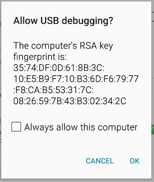

[](https://travis-ci.org/appium/appium-docker-android)
[](https://hub.docker.com/r/appium/appium/)
[](https://microbadger.com/images/appium/appium)
[](https://github.com/appium/appium-docker-android)
[](https://github.com/appium/appium-docker-android/fork)

# Appium Docker for Android

### Images Included:

- appium/appium - Docker Image to run appium tests on real android devices.
- To execute in android emulator's please visit [docker-android](https://github.com/butomo1989/docker-appium.git)

## Setting up Android real device test on Docker macOSX

1. Why is this approach needed at first place?
     
    - Helps in quick & easier setup of automation environment for appium + android
    - Without this approach, you'll need to do each of the automation setup steps manually; which can be slow and error prone
    - Refer to [Selenium Conference Youtube video](https://www.youtube.com/watch?v=jGW6ycW_tTQ&list=PLRdSclUtJDYXFVU37NEqh4KkT78BLqjcG&index=7) for more details

2. Make sure you have latest docker installed on mac.

	```
	$ docker-machine --version
	$ docker-machine version 0.10.0, build 76ed2a6
	```

3. Create a docker-machine as follows

	```
	$ docker-machine create --driver virtualbox appium-test-machine
	```

4. Enable USB in created docker-machine

	```
	$ docker-machine stop appium-test-machine
	$ vboxmanage modifyvm appium-test-machine --usb on --usbehci on
	$ docker-machine start appium-test-machine
	```
	***Note:***
	You need to install [Extension Pack](https://www.virtualbox.org/wiki/Download_Old_Builds_5_1) depends on your virtualbox version, in case you get an Error "Implementation of the USB 2.0 controller not found"

5. Open Virtual box, move to appium-test-machine created, select USB and add Android device and Host Controller.

	

6. SSH into the docker machine created

	```
	$ docker-machine ssh appium-test-machine
	```

7. Run the docker image

	```
	$ docker run --privileged -d -p 4723:4723  -v /dev/bus/usb:/dev/bus/usb --name container-appium appium/appium
	```

8. Plug in devices after container is running; otherwise it will shows nothing.

9. Run following command to verify adb devices can detect the connected android device.

	```
	$ docker exec -it container-appium adb devices
	```

10. Run UI Test with following test configuration

	```
	Push the apk file into the container
	$ docker cp /Users/loacl-macosx-path-to-apk/app-debug.apk container-appium:/opt

	Desired Capabilities:

	private void androidSetup() throws MalformedURLException {
	        caps.setCapability("deviceName", "Android");
	        caps.setCapability("app", "/opt/app-debug.apk");
	        //Get the IP Address of boot2docker
	        //docker inspect $(docker ps -q) | grep IPA
	        driver = new AndroidDriver<MobileElement>(new URL("http://192.168.99.100:32769/wd/hub"), caps);
	}
	```
### Share Android identification key

Each time, you will (re)create container, connected to container devices will ask for authorization after first
 connection.  To prevent that, you can share one identity through all created containers. To do that, you should: 
 
- Connect all devices to docker physical machine
- Run `adb devices`
- Authorize all devices (do not forget to check **Always allow this computer**)


 
- run your containers with parameter `-v ~/.android:/root/.android`

For example:
```
$ docker run --privileged -d -p 4723:4723 -v ~/.android:/root/.android -v /dev/bus/usb:/dev/bus/usb --name container-appium appium/appium
``` 

## Connect to Android devices by Air

Appium-Docker-Android can be connected with Android devices by Air.

To do that you need to configure android device, according to [official manual](https://developer.android.com/studio/command-line/adb.html#wireless)

Then run docker container with following parameters:

- REMOTE\_ADB=True
- ANDROID\_DEVICES=\<android\_device\_host\>:\<android\_device\_port\> \[,\<android\_device\_host\>:\<android\_device\_port\>\]
- REMOTE_ADB_POLLING_SEC=60 (default: 5, interval between polling the list of connected devices in order to connect to lost remote devices)

```
$ docker run -d -p 4723:4723 -e REMOTE_ADB=True -e ANDROID_DEVICES=192.168.0.5:5555,192.168.0.6:5555 -e REMOTE_ADB_POLLING_SEC=60 

``` 
	
## Connect to Selenium Grid

Appium-Docker-Android can be connected with selenium grid by passing following parameters:

- CONNECT\_TO\_GRID=True
- APPIUM\_HOST=\<ip\_address\_of\_appium\_server>
- APPIUM\_PORT=\<port\_of\_appium\_server>
- SELENIUM\_HOST=\<ip\_address\_of\_selenium\_hub>
- SELENIUM\_PORT=\<port\_of\_selenium\_hub>

```
$ docker run --privileged -d -p 4723:4723 -e CONNECT_TO_GRID=True -e APPIUM_HOST="127.0.0.1" -e APPIUM_PORT=4723 -e SELENIUM_HOST="172.17.0.1" -e SELENIUM_PORT=4444 -v /dev/bus/usb:/dev/bus/usb --name container-appium appium/appium
```

### Docker compose
There is [an example of compose file](docker-compose.yml) to simulate the connection between selenium hub and appium server mit connected device(s) in docker solution.

```
$ docker-compose up -d
```